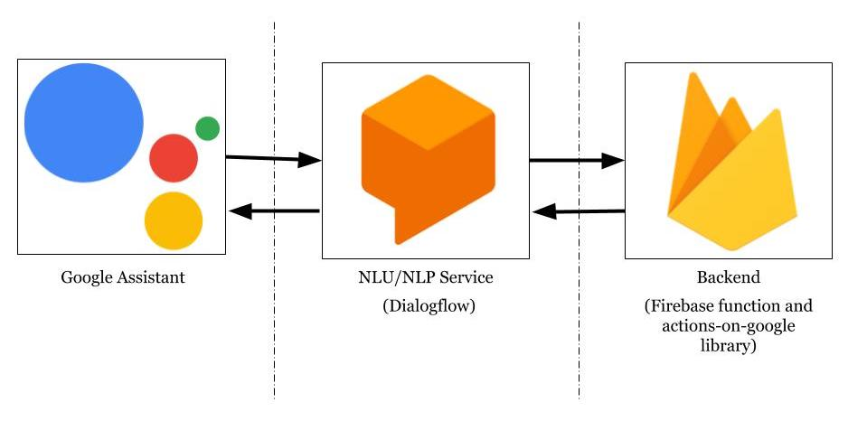

# Tutorial

# Part 1: Getting your Action set up end to end

There are 3 parts to the Google Action infrastructure that need setting up

## Step 1: Create a Google Action Project (Google Assistant)

_What is The Actions Console for? - This bit of your Action is for managing the Action as a whole. This is where you determine how the Action is invoked and where releases of the Action are managed. It also provides a simulator for testing the Action._

### Things to be done

Create a Google Action project by going to the [Actions Console](https://console.actions.google.com) and selecting Add/import project.

You will see this screen:

Select the 'Conversational' option.

## Step 2: Create a Dialogflow Agent

_What is Dialogflow for? Dialogflow is used to define 'Intents'. These are things the user of the Action wants to be able to do. For example we might define a weather intent. Dialogflow then uses Natural Language Understanding to match what the user says into an 'intent'. It takes unstructured data and turns it into something structured that we can respond to._

### Things to be done

In the Google Actions console go to `Build > Actions > Custom Intent > Build`. This take you to the [Dialogflow console](https://console.dialogflow.com) to create an Agent.

The Agent will have 2 intents:

- Default Welcome Intent
- Default Fallback Intent

Rename these to `Welcome` and `Fallback`

The Welcome intent is what is triggered when the Action is first used. It will be the first thing that responds to the user. The Fallback intent is a catch all. It will handle any input from the user that Dialogflow cannot map on to a specific intent.

Open the Welcome Intent.

Remove all of the Training Phrases

Remove all of the Responses

Under 'Fullfillment' select 'Enable webhook call for this intent'.

## Step 3: Create a Backend Fulfillment using Dialogflow

_What is the Backend for? Once Dialogflow has transformed the unstructured data into structured data it submits a POST request to a HTTP endpoint that will provide the response that will be sent to the user._

If the backend is very simple you can use Dialogflow's built in code editor.

### Things to be done

In the [Dialogflow console](https://console.dialogflow.com) go to 'Fulfillment' and enable the 'Inline Editor'.

Copy and paste the code from [here](../dialogflowFulfillment/inlineEditor.js) into the inline editor.

## Step 4: Test it

Go Back to the Google Actions [Console](https://console.actions.google.com) and go to `Test > Simulator`. This allows you to try out the Action enter 'Talk to my Test App' to get started.
