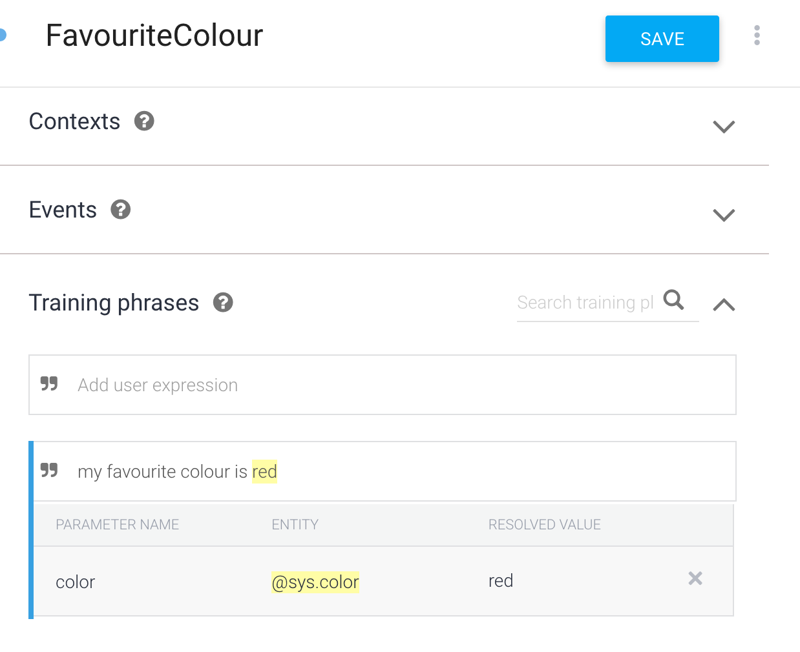
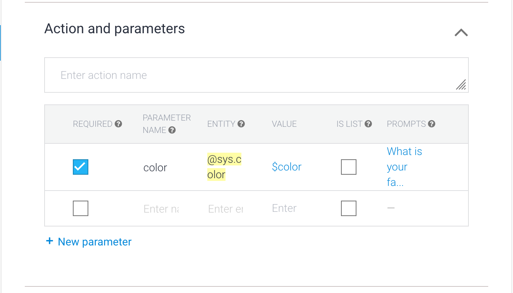

# Part 2: User Parameters

# Step 1: Add an intent in Dialogflow that collects parameters

If you want to get a specific parameter value e.g. get the user's favourite colour you need to define a Dialogflow intent.

## Things to be done

Go to the Dialogflow [console](https://console.dialogflow.com) and select 'Intents'

Call the intent 'FavouriteColour'

Add a training phrase "my favourite colour is red". Dialogflow will detect that this contains a system entity.

### _Side note: Entities_

_Dialogflow has entities which represent a category of 'things'. Dialogflow comes with some [pre-existing entities](https://dialogflow.com/docs/reference/system-entities) but you can also [define your own](https://dialogflow.com/docs/entities/create-manage-entities). Entities allow you to specify the data that you need to extract_

The entity signals to Dialogflow the part of the user input you are interested in. In the 'Action and parameters' section of the 'FavouriteColour' intent. The parameter will already have been defined for colour. Make sure 'Required' is selected and that you have defined a prompt.

Under 'Fulfillment' make sure 'Enable webhook call for this intent' is enabled.

### _Extras_

_You can add more training phrases to the 'Training phrases' section. These are any phrases that you think the user might say to specify their colour._

_If you want to rename the parameter value from the default 'color' this can also be done in the 'Training phrases' section_

# Step 2: Provide Fulfillment for the Intent

There needs to be some code in the fulfillment to handle the intent that we have just defined

In the [Dialogflow console](https://console.dialogflow.com) go to 'Fulfillment'

Copy and paste the code from [here](../dialogflowFulfillment/inlineEditorPart2.js) into the inline editor.

## Step 3: Test it

Go Back to the Google Actions [Console](https://console.actions.google.com) and go to `Test > Simulator`. This allows you to try out the Action enter 'Talk to my Test App' to get started.

# [Part 3](./part3.md)
